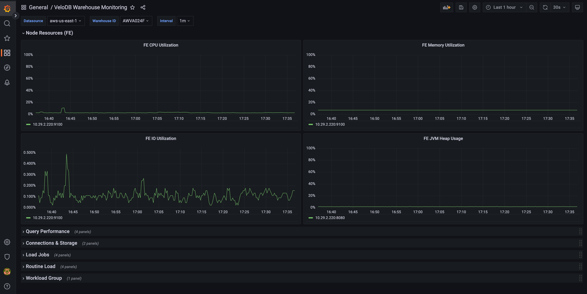
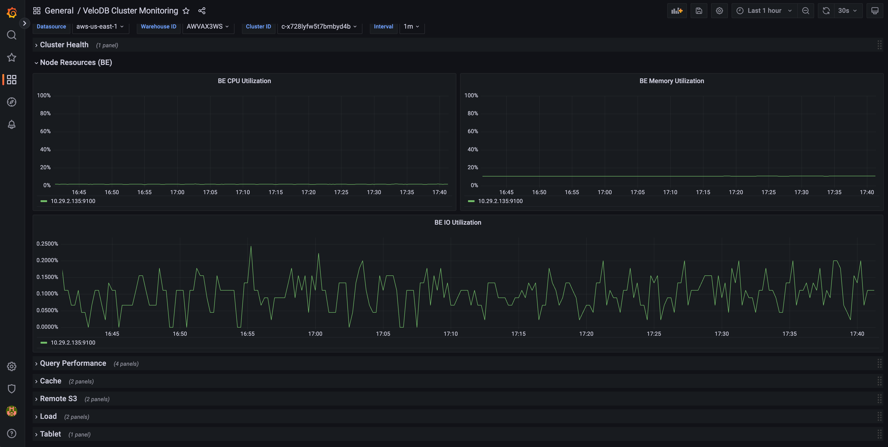

# VeloDB Cloud Monitoring Stacks

This repository provides ready-to-use monitoring integrations for **VeloDB Cloud**
(a managed cloud data warehouse service powered by Apache Doris). It is designed to
help you plug VeloDB Cloud's **Warehouse / Cluster** observability into an existing
Prometheus + Grafana stack with minimal effort.

> VeloDB Cloud exposes warehouse internals through a managed **Metrics API** in
> the Prometheus exposition format. All you need to do is point your Prometheus at
> that API; the Grafana dashboards in this repository will then light up out of the box.
>
> Official reference: <https://docs.velodb.io/cloud/26.x/management-guide/monitoring/metrics>

---

## What's in the box

The repository ships a ready-to-use Prometheus + Grafana bundle: sample
Prometheus configuration that scrapes the VeloDB Cloud Metrics API, plus
Grafana dashboards you can drop straight into your existing observability
platform.

```
monitoring-stacks/
└── prometheus-grafana/
    ├── prometheus/
    │   ├── prometheus.yml                        # Sample scrape config
    │   └── targets/
    │       ├── velodb_warehouse.yml              # Warehouse targets (file_sd)
    │       └── velodb_cluster.yml                # Cluster targets (file_sd)
    └── grafana/
        └── dashboard/
            ├── grafana_dashboard_warehouse.json  # Warehouse-level dashboard
            └── grafana_dashboard_cluster.json    # Compute cluster-level dashboard
```

| File | UID | Scope | Primary coverage |
| --- | --- | --- | --- |
| `grafana_dashboard_warehouse.json` | `velodb-warehouse-dashboard` | Warehouse (`$wid`) | FE node resources, query performance, connections / storage, load jobs, routine load, workload group |
| `grafana_dashboard_cluster.json`   | `velodb-cluster-dashboard`   | Compute cluster (`$wid` + `$cid`) | Cluster health, BE node resources, query performance, cache, remote S3, load, tablet compaction |

### Screenshots

**VeloDB Warehouse Monitoring** — FE-side resources and warehouse-level business metrics, filtered by `Warehouse ID`:



**VeloDB Cluster Monitoring** — BE-side runtime health for a single compute cluster, filtered by `Warehouse ID` + `Cluster ID`:



---

## Architecture overview

```
┌──────────────────────────┐    HTTPS (X-API-Key)    ┌──────────────────┐    PromQL    ┌──────────────────┐
│ VeloDB Cloud Metrics API │ ─────────────────────►  │    Prometheus    │ ───────────► │     Grafana      │
│  /v1/warehouse/{wid}/... │                         │  (scrape every   │              │  (dashboards in  │
│           metrics        │                         │      15s+)       │              │   this repo)     │
└──────────────────────────┘                         └──────────────────┘              └──────────────────┘
```

VeloDB Cloud already collects FE/BE metrics on the server side, so **no exporter
needs to be deployed by the user**. A standard Prometheus instance scraping the
Metrics API via an API key is enough.

---

## Prerequisites

- Prometheus **≥ 2.43** (required for the `http_headers` field in `scrape_configs`)
- Grafana **≥ 10.0**
- A VeloDB Cloud **API key** of the form `sk-xxxxxxxx`, created under the
  organization that owns the warehouse
- The regional endpoint that hosts your warehouse, e.g.
  - AWS US East 1: `apps-api.us-east-1.aws.velodb.cloud`
  - AWS Asia Pacific NorthEast 1: `apps-api.ap-northeast-1.aws.velodb.cloud`
  - GCP US Central 1: `apps-api.us-central1.gcp.velodb.cloud`

> Metrics API rate limit: **30 requests per minute per cluster**. Each scrape
> against a warehouse or cluster endpoint counts as one request, so a
> `scrape_interval` of **≥ 15s** (≤ 4 req/min) keeps you comfortably within
> the budget. Stacking multiple Prometheus instances or shrinking the interval
> below 2s per cluster will trigger 429s.

---

## Quick start

### 1. Configure Prometheus to scrape the VeloDB Cloud Metrics API

A ready-to-use sample lives in
[`prometheus-grafana/prometheus/`](prometheus-grafana/prometheus/). It uses
`file_sd_configs` so that adding more warehouses or clusters later is just a
YAML edit.

[`prometheus-grafana/prometheus/prometheus.yml`](prometheus-grafana/prometheus/prometheus.yml):

```yaml
scrape_configs:
  # ---- Warehouse-level ----
  - job_name: velodb-warehouse
    scheme: https
    scrape_interval: 30s
    metrics_path: /metrics            # overridden per-target via __metrics_path__
    http_headers:
      X-API-Key:
        values:
          - sk-xxxxxxxxxxxxxxxxxxxx
    file_sd_configs:
      - files:
          - targets/velodb_warehouse.yml
        refresh_interval: 1m

  # ---- Cluster-level ----
  - job_name: velodb-cluster
    scheme: https
    scrape_interval: 30s
    metrics_path: /metrics
    http_headers:
      X-API-Key:
        values:
          - sk-xxxxxxxxxxxxxxxxxxxx
    file_sd_configs:
      - files:
          - targets/velodb_cluster.yml
        refresh_interval: 1m
```

[`prometheus-grafana/prometheus/targets/velodb_warehouse.yml`](prometheus-grafana/prometheus/targets/velodb_warehouse.yml) (one entry per warehouse):

```yaml
- targets:
    - apps-api.us-east-1.aws.velodb.cloud
  labels:
    __metrics_path__: /v1/warehouse/XXZ0RP/metrics
    warehouse: XXZ0RP
```

[`prometheus-grafana/prometheus/targets/velodb_cluster.yml`](prometheus-grafana/prometheus/targets/velodb_cluster.yml) (one entry per compute cluster):

```yaml
- targets:
    - apps-api.us-east-1.aws.velodb.cloud
  labels:
    __metrics_path__: /v1/warehouse/XXZ0RP/cluster/CLU123/metrics
    warehouse: XXZ0RP
    cluster: CLU123
```

> Samples returned by the Metrics API already carry labels such as `provider`,
> `region`, `wid`, `cid`, `instance`, `vpc_id`, and `product`. The dashboard
> variables `$wid` / `$cid` are derived directly from these labels, so **no
> PromQL changes are required** inside the dashboard JSON.

### 2. Import the dashboards into Grafana

1. In Grafana, go to **Dashboards → New → Import**.
2. Upload `prometheus-grafana/grafana/dashboard/grafana_dashboard_warehouse.json`
   (and/or `..._cluster.json`).
3. Pick the Prometheus data source you configured in the previous step.
4. Inside the dashboard, select the target **Warehouse ID (`$wid`)** from the
   dropdown; for the cluster dashboard, also pick the **Cluster ID (`$cid`)**.

### 3. Verify

- In Prometheus, check **Status → Targets** and confirm that both jobs are **UP**.
- In Grafana, confirm that series such as `doris_fe_connection_total` and
  `doris_be_*` are populated.

---

## Dashboards in detail

### Warehouse dashboard (`velodb-warehouse-dashboard`)

Focused on **FE (Frontend)** nodes and warehouse-level business metrics.

| Panel group | Key panels |
| --- | --- |
| Node Resources (FE) | FE CPU / Memory / IO utilization, FE JVM heap usage |
| Query Performance | QPS, query success rate, average / P99 latency |
| Connections & Storage | Total connections, table storage size |
| Load Jobs | Finished load jobs, load job average time, broker / insert-into frequency |
| Routine Load | Job statistics, lag, abort transaction, abnormal paused |
| Workload Group | Workload group queries |

Template variables: `DS_PROMETHEUS`, `wid`, `interval`.

### Cluster dashboard (`velodb-cluster-dashboard`)

Focused on **BE (Backend)** nodes and the runtime health of a single compute cluster.

| Panel group | Key panels |
| --- | --- |
| Cluster Health | BE dead node count |
| Node Resources (BE) | BE CPU / Memory / IO utilization |
| Query Performance | QPS, query success rate, average / P99 latency |
| Cache | Cache hit rate, cache utilization |
| Remote S3 | Remote S3 read/write QPS, throughput |
| Load | Load bytes speed, stream load job frequency |
| Tablet | Tablet compaction score |

Template variables: `DS_PROMETHEUS`, `wid`, `cid`, `interval`.

---

## FAQ

**Q: The scrape returns 401 / 403.**
A: Confirm that the `X-API-Key` header is actually being sent and that the key
has access to the organization that owns the target warehouse.

**Q: The scrape returns 429.**
A: You hit the per-cluster rate limit (**30 req/min/cluster**). Increase
`scrape_interval`, or make sure that only one Prometheus instance is scraping
each warehouse / cluster endpoint — multiple Prometheis sharing the same
target will compound requests against the same quota.

**Q: The `$wid` dropdown in Grafana is empty.**
A: Prometheus has not yet ingested `doris_fe_connection_total`. Make sure the
warehouse scrape job is UP and that the warehouse is in the **Running** state —
suspended warehouses do not expose the full metric set.

**Q: Can a single configuration scrape multiple regions?**
A: Yes. Add the regional endpoint hostnames as different `targets` entries in
your `targets/*.yml` files. Note that different regions usually require
separate API keys.

---

## Roadmap

- [ ] Alertmanager rule examples (dead nodes, P99 spikes, abnormal compaction score, etc.)
- [ ] Docker Compose stack to spin up Prometheus + Grafana with the dashboards preloaded
- [ ] Kubernetes (kube-prometheus-stack) `ServiceMonitor` / `PrometheusRule` CRD examples
- [ ] OpenTelemetry Collector forwarding example (for Datadog, New Relic, and similar backends)

---

## Contributing

Issues and pull requests are welcome, for example:

- New or improved dashboard panels
- Integrations with other visualization stacks (Datadog, New Relic, Elastic, etc.)
- Documentation fixes and translations

Before submitting a PR, please make sure the dashboard JSON still imports cleanly
into Grafana ≥ 10.0.

---

## References

- VeloDB Cloud Metrics API: <https://docs.velodb.io/cloud/26.x/management-guide/monitoring/metrics>
- Prometheus `http_headers` configuration: <https://prometheus.io/docs/prometheus/latest/configuration/configuration/#scrape_config>
